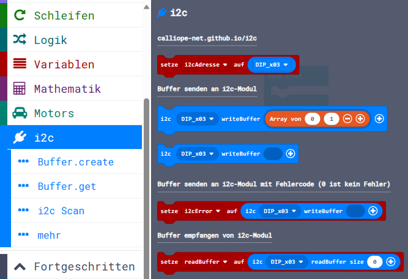

Diese Seite bei [https://calliope-net.github.io/i2c/](https://calliope-net.github.io/i2c/) öffnen.

### Calliope Erweiterung mit Blöcken zur Programmierung beliebiger i2c Module ohne JavaScript.

Dieses Repository kann als **Erweiterung** in MakeCode hinzugefügt werden.

* öffne [makecode.calliope.cc](https://makecode.calliope.cc)
* klicke auf eine Projektvorlage
* klicke unter dem Zahnrad-Menü auf **Erweiterungen** (oder bei den Blöcken ganz unten)
* kopiere die folgende **Projekt-URL** in die Zwischenablage (Strg-C)
* **calliope-net/i2c**
* füge sie auf der Webseite oben ein (Strg-V) und klicke auf die Lupe (oder ENTER)

* wenn die Erweiterung gefunden wurde, klicke auf das Rechteck
* jetzt hat die Liste den neuen Eintrag **i2c** bekommen

### Beschreibung der Erweiterung 'i2c'

I²C bedeutet *Inter-Integrated Circuit* → [Wikipedia](https://de.wikipedia.org/wiki/I%C2%B2C). Am Calliope mini ist der linke Steckverbinder A0 ein I²C Anschluss.
An die 4 Drähte Minus (GND), Plus (3,3 Volt), SDA und SCL können mehrere I²C Module gleichzeitig angeschlossen werden. Als Verteiler gibt es I²C Hubs mit 4 oder 6 Buchsen,
die ohne Elektronik einfach miteinander verbunden sind. Qwiic Module haben meistens 2 Buchsen und können hintereinander gefädelt werden → [Daisy Chain](https://de.wikipedia.org/wiki/Daisy_Chain).
Das nennt man dann I²C Bus → [Datenbus](https://de.wikipedia.org/wiki/Bus_(Datenverarbeitung)#Bussysteme).

Zur Unterscheidung hat jedes I²C Modul am Bus eine andere I²C Adresse. Die Anzahl der I²C Adressen ist begrenzt auf 7 Bit, 00000000 bis 01111111, 0 bis 127 oder hexadezimal 0x00 bis 0x7F, 
wovon aber einige wenige reserviert sind. Wenn am Modul die I²C Adresse geändert wird, können also mehrere gleiche Module am selben I²C Bus angeschlossen werden.

Zur Programmierung des I²C Bus gibt es nur 2 Funktionen: Senden und Empfangen. 

### Erweiterungen

> [Upates für Erweiterungen; Erweiterungen aus einem Projekt löschen.](https://calliope-net.github.io/i2c-liste#updates)

> [Alle i2c-Erweiterungen für MakeCode von calliope-net (Software).](https://calliope-net.github.io/i2c-liste#erweiterungen)

#### Calliope-Apps, .hex-Dateien, Bildschirmfotos mit Blöcken

> [Alle Beispiel-Projekte für MakeCode von calliope-net (Calliope-Apps).](https://calliope-net.github.io/i2c-liste#programmierbeispiele)

> GitHub-Profil calliope-net: [https://github.com/calliope-net](https://github.com/calliope-net)

### Bezugsquellen

> [Alle i2c-Module und Bezugsquellen (Hardware).](https://calliope-net.github.io/i2c-liste#bezugsquellen)

#### Metadaten (verwendet für Suche, Rendering)

* Calliope mini
* i2c
