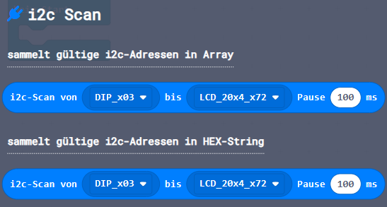

Diese Seite bei [https://calliope-net.github.io/i2c/](https://calliope-net.github.io/i2c/) öffnen.

### Calliope Erweiterung mit Blöcken zur Programmierung beliebiger i2c Module ohne JavaScript.

Dieses Repository kann als **Erweiterung** in MakeCode hinzugefügt werden.

* öffne [makecode.calliope.cc](https://makecode.calliope.cc)
* klicke auf eine Projektvorlage
* klicke unter dem Zahnrad-Menü auf **Erweiterungen** (oder bei den Blöcken ganz unten)
* kopiere die folgende **Projekt-URL** in die Zwischenablage (Strg-C)
* **calliope-net/i2c**
* füge sie auf der Webseite oben ein (Strg-V) und klicke auf die Lupe (oder ENTER)

* wenn die Erweiterung gefunden wurde, klicke auf das Rechteck
* jetzt hat die Liste den neuen Eintrag **i2c** bekommen

### Beschreibung der Erweiterung 'i2c'

I²C bedeutet *Inter-Integrated Circuit* → [Wikipedia](https://de.wikipedia.org/wiki/I%C2%B2C). Am Calliope mini ist der linke Steckverbinder A0 ein I²C Anschluss.
An die 4 Drähte Minus (GND), Plus (3,3 Volt), SDA und SCL können mehrere I²C Module gleichzeitig angeschlossen werden. Als Verteiler gibt es I²C Hubs mit 4 oder 6 Buchsen,
die ohne Elektronik einfach miteinander verbunden sind. Qwiic Module haben meistens 2 Buchsen und können hintereinander gefädelt werden → [Daisy Chain](https://de.wikipedia.org/wiki/Daisy_Chain).
Viele Module an nur einem Anschluss nennt man → [Bus](https://de.wikipedia.org/wiki/Bus_(Datenverarbeitung)#Bussysteme) hier: I²C Bus.

Zur Unterscheidung hat jedes I²C Modul am Bus eine andere I²C Adresse. Die Anzahl der I²C Adressen ist begrenzt auf 7 Bit, 00000000 bis 01111111, 0 bis 127 oder hexadezimal 0x00 bis 0x7F, 
wovon aber einige Adressen reserviert sind. Wenn am Modul die I²C Adresse geändert werden kann, können also mehrere gleiche Module am selben I²C Bus angeschlossen werden.

Zur Programmierung des I²C Bus gibt es nur 2 Funktionen: **Senden** und **Empfangen**.

Zum **Senden** werden ein oder mehrere Bytes in einen Buffer gepackt und der Buffer über den I²C Bus an eine bestimmte I²C Adresse geschickt. Das Modul mit der richtigen I²C Adresse empfängt den Buffer.
Die Module mit den anderen I²C Adressen ignorieren die Datenübertragung.

Zum **Empfangen** wird nur die Anzahl der Bytes *size* an eine bestimmte I²C Adresse geschickt. Das Modul mit der richtigen I²C Adresse schickt dann einen Buffer zurück, der genau so viele Bytes lang ist.
Der empfangene Buffer wird in einer Variable *readBuffer* gespeichert und kann ausgewertet werden.

> Ein **Byte** besteht IMMER aus 8 Ziffern, die 0 oder 1 sein können. Eine Ziffer, die nur zwei Zustände haben kann, heißt **Binary Digit** abgekürzt **Bit**.
> Ein Byte hat also IMMER 8 Bit und kann 2^8 = 2\*2\*2\*2\*2\*2\*2\*2 = 256 verschiedene Werte speichern. Größere Zahlen und andere Daten brauchen entsprechend mehrere Bytes.

> Ein **Buffer** ist eine Sammlung von Bytes (je 8 Bit) in einer bestimmten Reihenfolge. Die Position eines Bytes im Buffer heißt **offset**. Das erste Byte steht am offset=0.

#### Blöcke ####

Zum **Senden** stellt die Erweiterung 'i2c' den Block **writeBuffer** bereit. Den Block gibt es 3 Mal mit der gleichen Funktion.

1. **writeBuffer** mit Array als Parameter
   * Hier können direkt Bytes eingetragen werden. Die korrekte Anzahl der Bytes muss mit - + eingestellt werden.
   * Es dürfen nur 8-Bit Zahlen (0-255) eingetragen werden.
   * Für 16-Bit und 32-Bit Zahlen, die mehrere Bytes belegen, existiert der Block *.setNumber* im Bereich *Buffer.create*.
2. **writeBuffer**, dem eine Variable vom Typ Buffer übergeben werden muss
   * Im Bereich *Buffer.create* gibt es mehrere Möglichkeiten, einen leeren Buffer zu erzeugen und schrittweise zu füllen oder einen Buffer aus vorhandenen Daten zu erzeugen.
   * Der neue Buffer wird einer Variablen zugewiesen, die dem Block **writeBuffer** zu übergeben ist.
3. **writeBuffer** wie 2. mit Rückgabe des Fehlercode beim Senden
   * In der Variable i2cError wird das Ergebnis vom Senden gespeichert. Der Wert 0 bedeutet kein Fehler.
   * Der Wert -1010 (dezimal) wird zurück gegeben, wenn an der I²C Adresse kein I²C Modul antwortet und den Buffer empfängt.

Zum **Empfangen** stellt die Erweiterung 'i2c' den Block **readBuffer** bereit.

1. **readBuffer**
   * Bei *size* ist die Anzahl der vom I²C Modul als Antwort erwarteten Bytes einzutragen.
   * Der empfangene Buffer wird der Variable readBuffer zugewiesen.
   * Im Bereich *Buffer.get* gibt es mehrere Möglichkeiten, den Buffer auszuwerten. Dazu muss die Variable readBuffer in den Block eingefügt werden.

Die 2 Blöcke **i2c-Scan** haben die gleiche Funktion und unterscheiden sich nur im Rückgabe Parameter.

Im Bereich *i2c Scan* sind Blöcke, die im angegebenen Bereich von - bis alle I²C Adressen testen, ob ein I²C Modul angeschlossen ist.
Die Pause zwischen zwei Tests kann angegeben werden. Im Test wird ein Byte mit dem Wert 0 an jede I²C Adresse geschickt und das Ergebnis von writeBuffer ausgewertet.
Ist das Ergebnis = 0, wird angenommen, dass an der I²C Adresse ein Modul vorhanden ist und den Buffer empfangen hat.
Das funktioniert allerdings nicht bei jedem Modul, das LCD 16x2 Modul wird z.B. nicht erkannt.

Der i2c-Scan ist geeignet, Module zu finden, deren I²C Adresse durch Software geändert und vergessen wurde.

Der Test findet ohne angeschlossene I²C Module die I²C Adressen 0x10, 0x18 und 0x68. Diese sind vom Calliope intern belegt und können nicht von externen Modulen verwendet werden.

1. **i2c-Scan** gibt ein Array mit den I²C Adressen aller am I²C Bus gefundenen Module zurück.
2. **i2c-Scan** wie 1. wandelt die Bytes aus dem Array in hexadezimal Zahlen um und gibt sie als Text zurück. Der Text kann unmittelbar in der LED-Matrix angezeigt werden.

### Erweiterungen

> [Upates für Erweiterungen; Erweiterungen aus einem Projekt löschen.](https://calliope-net.github.io/i2c-liste#updates)

> [Alle i2c-Erweiterungen für MakeCode von calliope-net (Software).](https://calliope-net.github.io/i2c-liste#erweiterungen)

#### Calliope-Apps, .hex-Dateien, Bildschirmfotos mit Blöcken

> [Alle Beispiel-Projekte für MakeCode von calliope-net (Calliope-Apps).](https://calliope-net.github.io/i2c-liste#programmierbeispiele)

> GitHub-Profil calliope-net: [https://github.com/calliope-net](https://github.com/calliope-net)

### Bezugsquellen

> [Alle i2c-Module und Bezugsquellen (Hardware).](https://calliope-net.github.io/i2c-liste#bezugsquellen)

#### Metadaten (verwendet für Suche, Rendering)

* Calliope mini
* i2c
